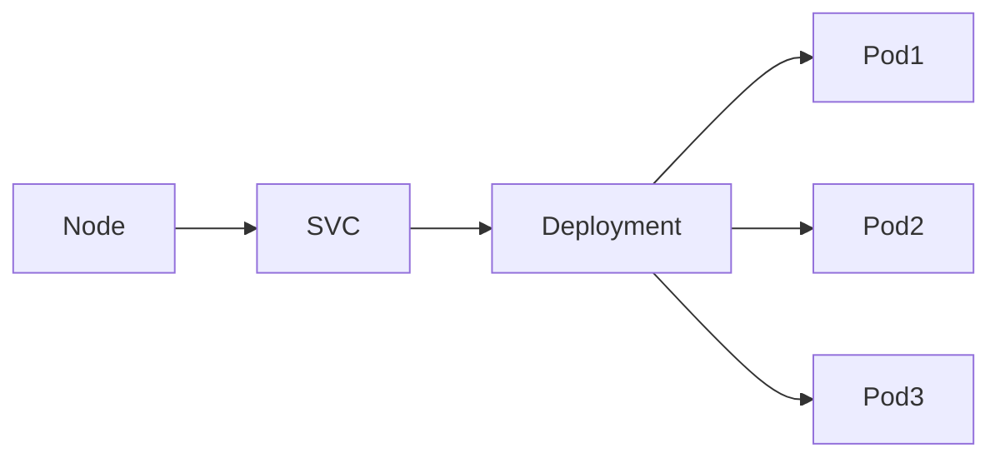

架构：

```mermaid
flowchart LR
	Node-->SVC
	SVC-->Deployment
	Deployment-->Pod1
	Deployment-->Pod2
	Deployment-->Pod3
```

## 作用

方便部署更多的Pod副本在不同的Node节点上， 当一个Node出现故障时也可以把流量转到其他健康节点上以保证高可用性

1. 高可用
2. 副本控制, 例如部署了3个副本， 如果有副本发生故障， 就会重新创建一个副本， 始终保持3个副本运行
3. 滚动更新
4. 自动扩缩容
