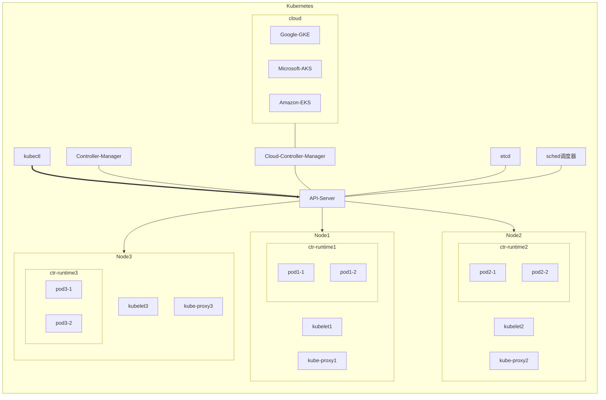

架构：

## 作用

### 权限认证

当kubectl或者类似外部的UI界面的控制器等需要对Pod等资源进行管理时， 必须经过API-Server， 检查kubectl等工具是否有权限创建、删除等操作Pod的权限

### 网关

当kubectl等工具有权限对Pod等资源进行创建、删除等操作时， 会将转发这些操作给Sched调度器组件进行处理，
根据算法策略把Pod调度到合适的节点，也可以对Pod限制节点亲和性之类进行有权重调度
