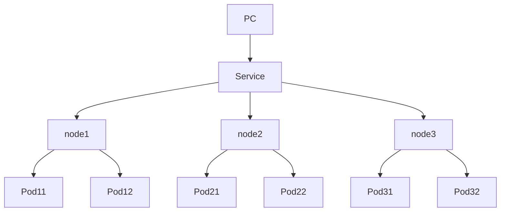

## 初始化
[解析](https://kubernetes.io/zh-cn/docs/reference/setup-tools/kubeadm/kubeadm-init/)

### 初始化的阶段
1.  preflight 运行安装前检查
2. Certificate generation 生成证书
3. Generate all kubeconfig files necessary to establish the control plane and the admin kubeconfig file 生成建立控制平面所需的所有kubecconfig文件和admin kubecconfig文件
4. kubelet-start  Write kubelet settings and (re)start the kubelet 启动`kubelet`
5. etcd 生成建立控制平面所需的所有静态Pod清单文件
6. 更新kubeadm与kubelet的配置文件
7. 上传证书到kubeadm-cert
8. 将节点标记为控制平面
9. 生成token,用于将节点加入到集群
10. TLS引导后更新kubelet相关的设置
11. 安装通过一致性测试所需的附加组件
12. 显示控制与工作节点连接的指令

解析:
1.  在做出变更前运行一系列的预检项来验证系统状态。一些检查项目仅仅触发警告， 其它的则会被视为错误并且退出 kubeadm，除非问题得到解决或者用户指定了 `--ignore-preflight-errors=<错误列表>` 参数。

2.  生成一个自签名的 CA 证书来为集群中的每一个组件建立身份标识。 用户可以通过将其放入 `--cert-dir` 配置的证书目录中（默认为 `/etc/kubernetes/pki`） 来提供他们自己的 CA 证书以及/或者密钥。 APIServer 证书将为任何 `--apiserver-cert-extra-sans` 参数值提供附加的 SAN 条目，必要时将其小写。

3.  将 kubeconfig 文件写入 `/etc/kubernetes/` 目录以便 kubelet、控制器管理器和调度器用来连接到 API 服务器，它们每一个都有自己的身份标识，同时生成一个名为 `admin.conf` 的独立的 kubeconfig 文件，用于管理操作。

4.  为 API 服务器、控制器管理器和调度器生成静态 Pod 的清单文件。假使没有提供一个外部的 etcd 服务的话，也会为 etcd 生成一份额外的静态 Pod 清单文件。
    
    静态 Pod 的清单文件被写入到 `/etc/kubernetes/manifests` 目录； kubelet 会监视这个目录以便在系统启动的时候创建 Pod。
    
    一旦控制平面的 Pod 都运行起来，`kubeadm init` 的工作流程就继续往下执行。
    

5.  对控制平面节点应用标签和污点标记以便不会在它上面运行其它的工作负载。

6.  生成令牌，将来其他节点可使用该令牌向控制平面注册自己。 如 [kubeadm token](https://kubernetes.io/zh-cn/docs/reference/setup-tools/kubeadm/kubeadm-token/) 文档所述， 用户可以选择通过 `--token` 提供令牌。

7.  为了使得节点能够遵照[启动引导令牌](https://kubernetes.io/zh-cn/docs/reference/access-authn-authz/bootstrap-tokens/)和 [TLS 启动引导](https://kubernetes.io/zh-cn/docs/reference/access-authn-authz/kubelet-tls-bootstrapping/) 这两份文档中描述的机制加入到集群中，kubeadm 会执行所有的必要配置：
    
    -   创建一个 ConfigMap 提供添加集群节点所需的信息，并为该 ConfigMap 设置相关的 RBAC 访问规则。
        
    -   允许启动引导令牌访问 CSR 签名 API。
        
    -   配置自动签发新的 CSR 请求。
        
    
    更多相关信息，请查看 [kubeadm join](https://kubernetes.io/zh-cn/docs/reference/setup-tools/kubeadm/kubeadm-join/)。
    

8.  通过 API 服务器安装一个 DNS 服务器 (CoreDNS) 和 kube-proxy 附加组件。 在 Kubernetes 版本 1.11 和更高版本中，CoreDNS 是默认的 DNS 服务器。 请注意，尽管已部署 DNS 服务器，但直到安装 CNI 时才调度它。

## CRI
容器运行时接口(Container Runtime Interface)
kubelet在每个节点上运行. 管理和维护Pod的状态
CRI是kubelet与容器主要的通信协议, 所以只要是实现了kubernetes的CRI通信协议的容器都可以作为kubelet的容器运行时

> Docker不支持CRI, Kubernetes为了兼容Docker, 开发了Dockershim
> Kubernetes v1.24及之后版本已经抛弃对Docker的支持(从Kubernetes项目移除Dockershim模块)

## Namespace
命名空间: 利用不用的命名空间来区别不同的环境, 达到资源隔离
### 特性
包含:
- Service
- Deployment
不包含: 
- StorageClass、
- Node、
- PersistentVolume

默认自带四个命名空间:
- default: 用户默认的命名空间, 即不指定命名空间的情况下创建的Pod,Service,Deployment等
- kube-system: kubernetes系统对象(控制平面和Node组件)的命名空间
- kube-public: 公共命名空间, 所有(包括未经验证的)用户都可以读取到. 作为公用可见和可读的资源
- kube-node-lease: [租约](https://kubernetes.io/docs/reference/kubernetes-api/cluster-resources/lease-v1/), 对象使用的命名空间。每个节点都有一个关联的 lease 对象，lease 是一种轻量级资源。lease对象通过发送[心跳](https://kubernetes.io/zh-cn/docs/concepts/architecture/nodes/#heartbeats)，检测集群中的每个节点是否发生故障

## 配置对象

### labels
标签, 用户给资源标记
例子: 给nginx对象标记名称app为`nginx`, 环境env为生产环境`production`
```yml
metadata:
  label:
    app: nginx
    env: production
```
### apiVersion
kubernetes API版本

### kind
对象类别
#### Pod
#### Deployment
#### Service


### metadata
描述对象元数据信息

### spec
对象的配置

## 组件
### kube-apiserver
API服务器, 公开k8s API

## Service对象
1. 通过label关联pod
2. 生命周期不与Pod绑定, 不会因为Pod重建而改变IP
3. 提供负载均衡, 自动转发流量到不同的Pod
4. 对集群外部提供端口访问
5. 对集群内部通过服务名称访问

示例:


### ServiceType:
ClusterIP: 集群内部访问, Pod通过service的名称访问, 集群主机可以通过该service的IP访问
NodePort: 集群外部访问
ExternalName: 集群外部的网络引入集群内部
LoadBalancer: 使用云厂商的负载均衡器向外部暴露服务

## etcd 
键值数据库,可作为保存k8s集群数据的后台数据库

## kube-scheduler 
k8s负载均衡的调度Pod

## kube-controller 
集群控制器

## cloud-controller 
与云服务器商交互

## Deployment
Pod的IP会随时变化
无状态, 所有Pod等价, 可替代. 适合无状态应用
是对Pod与ReplicaSet(副本集, 控制运行多少个Pod)更高级的抽象, 

示例: Deployment 对象包含了两个 Pod 副本，通过标签选择器 `app:gobackend` 与 Pod 关联，并使用 Pod 模板指定要创建的 Pod 的标签和容器镜像等信息。
```yaml
apiVersion: apps/v1 # 使用 Kubernetes API 版本 v1 的 app 子版本
kind: Deployment # 定义一个 Deployment 对象

metadata: # 元数据信息
  name: test-k8s-backend # Deployment 的名称

spec: # 定义 Deployment 的规范和设置信息
  replicas: 2 # 创建的 Pod 副本数量

  selector: # 标签选择器，用于查找关联的 Pod
    matchLabels: # 所有标签都匹配才会选中 Pod
      app: gobackend # 运行应用程序的标签名为 gobackend

  template: # Pod 模板，定义了创建每个 Pod 所需的信息
    metadata:
      labels: # 创建 Pod 标签的名称和值对
        app: gobackend # 标签名为 app，标签值为 gobackend
    spec:
      containers: # 容器的列表
        - name: goback # 定义容器名称
          image: ccr.ccs.tencentyun.com/lisa/go:v1 # 容器镜像名称及版本号
          resources: 指定CPU内存设置
            limits:
              memory: 512Mi
              cpu: "1"
            requests:
              memory: 256Mi
              cpu: "0.2"
```

### Service
- 将一组Pods上的应用公开为网络服务的抽象
- Service 将一组Pod提供相同的DNS名, 在他们之间提供负载均衡
- Service中的Pod的IP不变
示例: Kubernetes 代码定义了一个名为 `gobackend` 的 Service，根据其标签选择器将流量转发到与之匹配的 Pod，将所有进入 Service 端口 8080 的流量转发到后端容器的 8080 端口，以便其他应用程序或服务可以在 Kubernetes 集群内部访问它
```yml
apiVersion: v1 # 使用 Kubernetes API 的默认版本 v1。
kind: Service # 定义一个 Service 对象。

metadata: # 元数据信息
  name: gobackend # 定义 Service 的名称为 gobackend。

spec: # 定义 Service 的规范和设置信息。
  selector: # 标签选择器，用于选择哪些 Pod 作为 Service 的后端。
    app: gobackend # 运行应用程序的标签名为 gobackend。
  type: ClusterIP # 指定 Service 的类型为 Cluster IP 类型。这种类型会为 Pod 创建一个虚拟 IP 地址，以允许其他 Pod 或 Service 在 Kubernetes 集群内部访问它。
  ports: # 在 Service 上打开的端口列表。
    - port: 8080   # 定义 Service 的端口号为 8080。
      targetPort: 8080  # 容器的端口号也是 8080，表示该 Service 将所有进入它端口的流量都转发到使用容器的 8080 端口的后端应用程序。
```

#### 对外暴露服务
1. ClusterIP 集群内部可访问
2. NodePort 集群节点外部可访问
3. LoadBalancer 负载均衡模式(需要负载均衡器可用)

```yml
spec:
	selector:
		app: backend
	type: NodePort # NodePort 节点可访问
	ports: 
		- port: 8080 # 本Service的端口
		  targetPort: 8080 # 容器端口
		  nodePort: 31000 # 节点端口 范围为30000~32767
```

### SataefulSet
有状态, 适合数据库

### DaemonSet
每一个节点跑一个Pod. 适合监控,节点日志收集等

### Job & CronJob
一次性/周期任务


