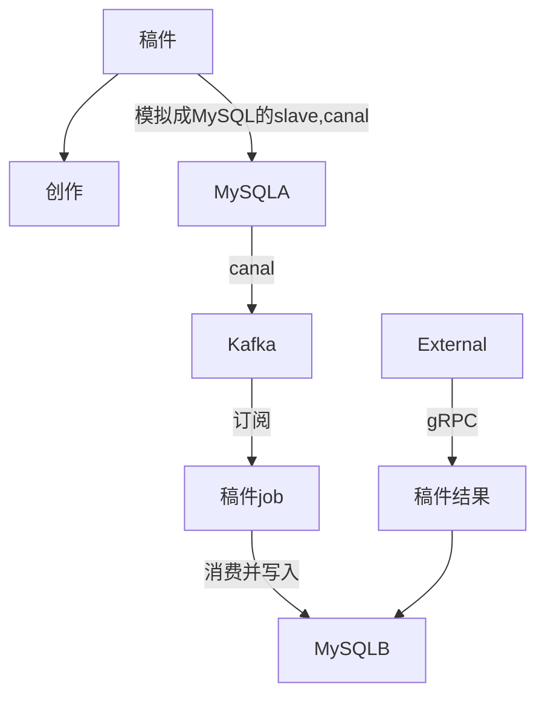
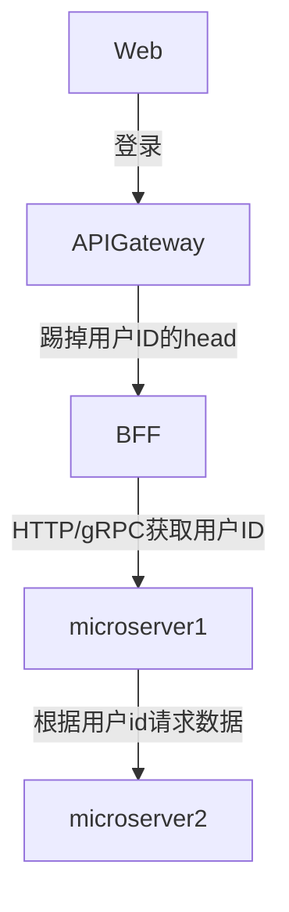

## Business Capacity职能划分
对于对业务模型不了熟悉的情况选择, 这种比较简单, 由公司不同部分进行划分的, 例如客服是提供客户服务的职能, 财务部们提供财务的相关服务

## Bounded Context 界限上下文
界限上下文是DDD中用来划分不同业务边界的元素, 是一种工程思路和架构思路. DDD对架构拆分, 软件工程组织有帮助
DDD用来划分不同业务边界的一种方式, 业务边界指的是解决不同业务问题的问题域和对应的解决方案域, 为了解决某种类型的业务问题, 贴近领域知识, 也就是业务, 解决一类业务场景, 解决某类业务场景, 它一定是贴近领域的一些知识, 也就是贴近业务维度的一个思考的划分方式
示例:
当用户需要投稿时: 会经过稿件API和视频API, 如果是按照职能划分, 那一定是稿件部分和视频部门两个来做, 如果是DDD, 就可以抽象为一个投稿服务, 对这个领域业务进行划分

## CQRS模式
将应用划分为两部分, 一个查询端和变更端, 例如稿件服务, 流程是:
这类服务通常都是有大量的变更, 但是用户只想知道最终结果, 但是这里查询和变更强耦合的话, 后续审核等越来越复杂时,判断的变量越来越多, 代码就更加耦合, 就把查询和变更进行拆分, 把业务划分为: 稿件审核负责业务变更, 投稿结果负责业务查询

## 微服务安全
外网信息安全强调信息安全, 内网的安全是认证和授权, 一般在内网的服务都是要做身份认证和授权
### 外网信息安全认证流程:
从前端登录, 使用账号密码登录, 然后经过网关, 网关为了防止恶意携带用户ID的攻击,需要踢掉这个Head头, 然后注入新的用户ID, 然后下发给BFF, BFF再head头或者gRPC的metadata重新获取用户的信息, 然后下游服务在rpc接口定义的用户ID, 根据用户的ID进行请求

### 内网信息安全
内网信息安全分为三种:
1. Full Trust, 完全信任机制. 没有任何安全机制, 微服务之间可以随意调用
2. Half Trust, 微服务知道是谁在调用, 但rpc流量没有任何安全的处理, 抓包时都是明文
3. Zero Trust, 0信任机制, 微服务之间既要做身份认证, 也要做, 同时也要做通讯的加解密(gRPC(基于HTTP2.0)支持TLS证书)
### 授权
顾名思义, 标志这个用户是谁, 就是你是否可以调用这个接口, 可以对这个接口可以做什么操作, 不可以做什么操作 

### 身份认证
#### 基于Token的认证
1. 判断你是谁: A服务通过颁发token给B服务, B服务在访问A服务的时候就知道是A服务在访问
2. 判断你可以请求什么: 

#### 基于证书的认证
1. 容器里需要有一个统一的根证书
2. 基于根证书再颁发新的证书, 例如颁发给a, b