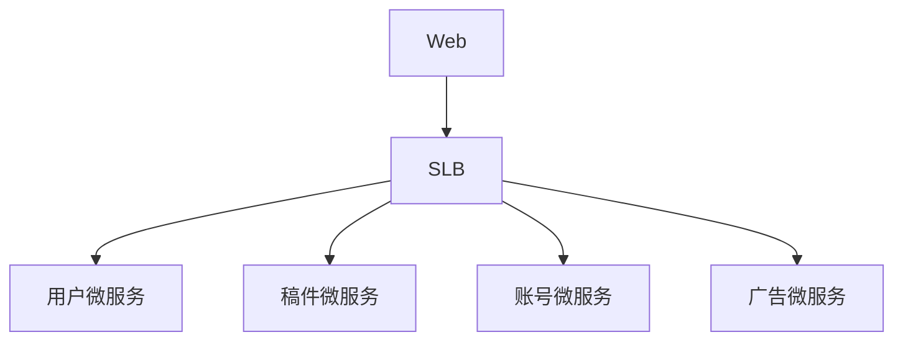
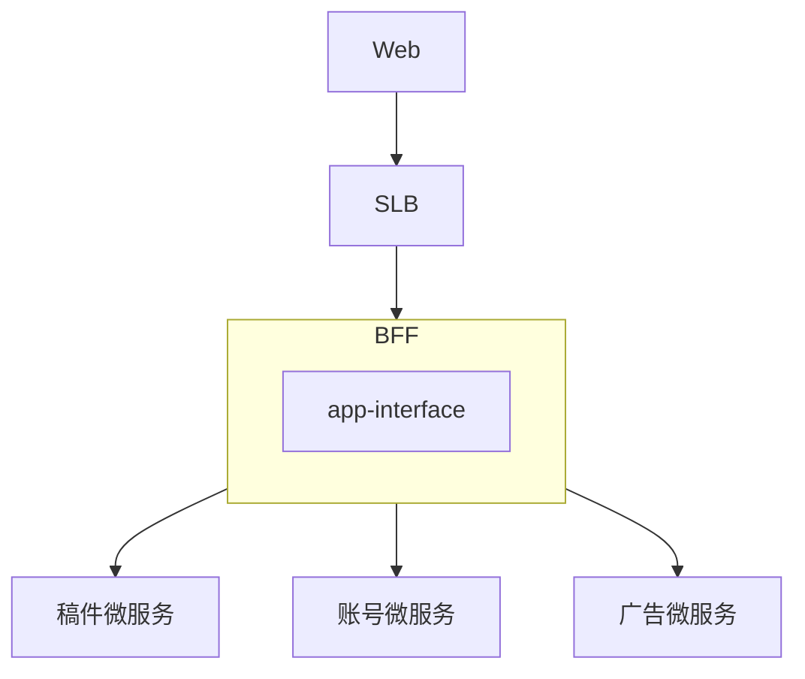
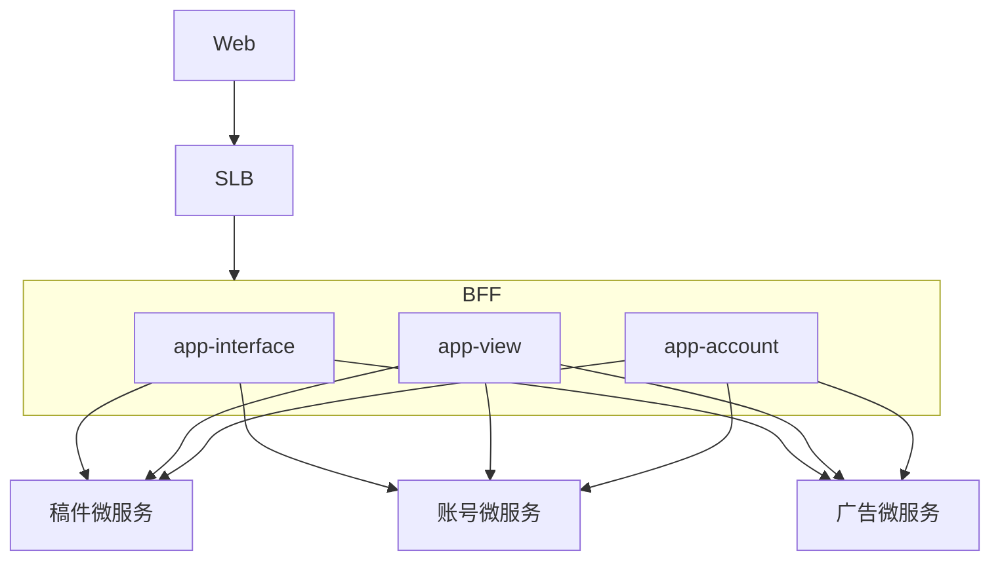
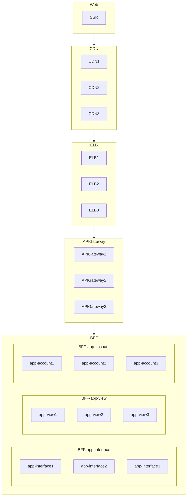

## BFF
全称: Backend for Frontend, 面向前端的后端服务
## 为什么需要?
1. 当一个Web服务访问AP时, API会同时请求其它的微服务API, 就需要设计并行编程, 然后进行组装(join), 就需要对这些微服务进行封装, 找一些好用的BFF库或手写一个BFF层, 还需要处理一个局部微服务失败之后如何处理

## 作用
组装服务, 是前端与后端团队的中间人, 面向业务的团队, 主要用于适配前端业务, 例如首页,需要访问不同的微服务, 把这些数据进行一个组装, 聚合之类的操作
## 与面向资源的区别
### 使用场景
BFF是适合面向外网的业务接口设计. 
而与面向资源的设计的HTTP Restful有很大不同, HTTP Restful强调单一性不一样, 更适合内网服务使用

## 非BFF的架构

缺点:
1. 交付速度慢
2. 演进慢, 需要每个服务都需要兼容
3. 客户端到微服务直接通信,强耦合
4. 需要多次请求, 客户端聚合数据, 工作量巨大, 延迟高
5. 协议不利于统一, 各部门有差异, 需要端对端来兼容
6. 统一逻辑无法收敛, 比如安全认证, 限流

## 单点BFF架构

### 单点BFF缺陷
缺点:
1. 所有流量都经过一个BFF的app-interface层, 只要app-interface层一挂, 全部都挂了
2. 流量高峰也会导致集群宕机
3. 兼容性难, 所有业务都是在一个app-interface层, 与移动端交付更困难

## BFF设计
1. 格式适配(用户在不同网络场景, 2345G/wifi环境下如何加载图片(普清/高清))
2. 兼容, 针对TV/APP/Web/HD进行不同的兼容性设计, 后端微服务不考虑面向终端的兼容设计, 让后端的微服务可以进行快速迭代演进
3. 聚合
4. 裁剪

### 多点BFF架构
#### 按重要性拆分
例如核心的播放(app-view)拆分一个接口, 一个用户账号拆分一个接口, 杂七杂八的设置都在这个app-interface接口

## 多点BFF架构缺陷
对跨横切面的逻辑, 例如安全, 限流, 熔断, 统一认证,日志监控等, 都需要推动这些BFF去升级, 有难度

## API Gateway
针对多点BFF架构缺陷, 演进出了API Gateway,把安全, 限流, 熔断, 统一认证这些跨横切面的逻辑都上放到了API Gateway, 由API Gatewa来实现, 把BFF当成了一个基础设施, 实现关注点, 专门对业务进行兼容, 不对安全, 限流, 熔断, 统一认证这些跨横切面的逻辑这些通用逻辑维护

最终架构图:

