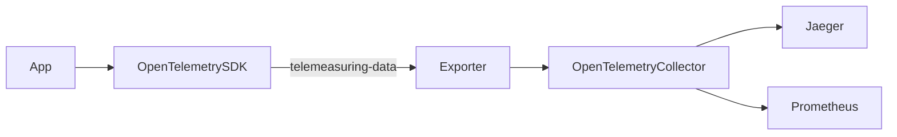
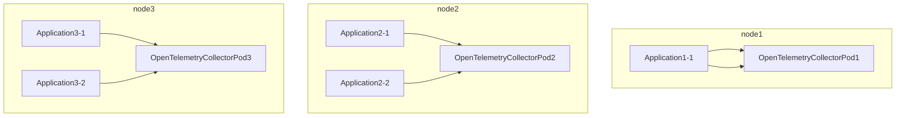
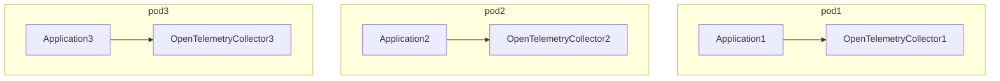

## 前置条件
1. 拥有一个正常运行的Kubernetes集群
2. 服务端已安装Prometheus, 并与Kubernetes集群正常通信
3. 服务端已安装Jaeger, 并与Kubernetes集群正常通信
4. 客户端go 版本>=1.13

## 说明
- ct: 即`kubectl`的简写形式, 个人爱好, 图片里使用`ct`简写代替了`kubectl`

## 架构


## OpenTelemetry服务端环境搭建
OpenTelemetry服务端分为Daemonset和Sidecar模式

### Daemonset
Daemonset是在集群中的每一个节点运行一个OpenTelemetry Collector Pod,遥测数据需要导出到worknode的OpenTelemetry Collector Pod上, 通常需要一个网关Collector




### Sidecar
Sidecar 是一个pod运行一个OpenTelemetryCollector实例

```

它们会去安装cert-manager和创建CRD,用于管理OpenTelemetry的和instrumentations.opentelemetry.io自动埋点
```shell
ct get crd | grep openTelemetry
```
![[images/Pasted image 20231114103025.png]]

# [OpenTelemetry Operator Helm Chart](https://github.com/open-telemetry/opentelemetry-helm-charts/tree/main/charts/opentelemetry-operator#opentelemetry-operator-helm-chart)
> 如果你已经安装了cert-manager, 则可以跳过安装cert-manager的阶段, 使用 --set admissionWebhooks.certManager.enable=false

Helm 图表在 Kubernetes 集群中安装 OpenTelemetry Operator。OpenTelemetry Operator 是 Kubernetes Operator 的实现。此时，它将 OpenTelemetry Collector 作为唯一的托管组件

希望 helm 创建自动生成的自签名证书，请确保在安装图表时设置适当的值:
```shell
helm install  --set admissionWebhooks.certManager.enabled=false --set admissionWebhooks.certManager.autoGenerateCert=true \
  opentelemetry-operator open-telemetry/opentelemetry-operator
```

### Yaml创建OpenTelemetry Collector(otelcol)实例
创建一个名为`simplest`的 OpenTelemetry Collector 实例，公开一个`jaeger-grpc`端口以使用检测应用程序中的跨度，并通过`debug`导出这些跨度，从而将跨度写入接收跨度的 OpenTelemetry Collector 实例的控制台 （`stdout`）
```bash
kubectl apply -f - <<EOF
apiVersion: opentelemetry.io/v1alpha1
kind: OpenTelemetryCollector
metadata:
  name: simplest
spec:
  config: |
    receivers:
      otlp:
        protocols:
          grpc:
          http:
    processors:
      memory_limiter:
        check_interval: 1s
        limit_percentage: 75
        spike_limit_percentage: 15
      batch:
        send_batch_size: 10000
        timeout: 10s

    exporters:
      debug:

    service:
      pipelines:
        traces:
          receivers: [otlp]
          processors: []
          exporters: [debug]
EOF
```
在集群查询**OpenTelemetry Collector**的端口, 这里为`30080`
![[images/Pasted image 20231113172147.png]]

## OpenTelemetry客户端环境搭建
该示例模拟一个应用程序，计算 10 秒钟，然后完成.
编写go主程序[1], 把`192.168.0.152:30080`替换为**OpenTelemetry Collector**实际的地址. 
```go
// Copyright The OpenTelemetry Authors
//
// Licensed under the Apache License, Version 2.0 (the "License");
// you may not use this file except in compliance with the License.
// You may obtain a copy of the License at
//
//     http://www.apache.org/licenses/LICENSE-2.0
//
// Unless required by applicable law or agreed to in writing, software
// distributed under the License is distributed on an "AS IS" BASIS,
// WITHOUT WARRANTIES OR CONDITIONS OF ANY KIND, either express or implied.
// See the License for the specific language governing permissions and
// limitations under the License.

// Example using OTLP exporters + collector + third-party backends. For
// information about using the exporter, see:
// https://pkg.go.dev/go.opentelemetry.io/otel/exporters/otlp?tab=doc#example-package-Insecure
package main

import (
	"context"
	"fmt"
	"log"
	"os"
	"os/signal"
	"time"

	"google.golang.org/grpc"
	"google.golang.org/grpc/credentials/insecure"

	"go.opentelemetry.io/otel"
	"go.opentelemetry.io/otel/attribute"
	"go.opentelemetry.io/otel/exporters/otlp/otlptrace/otlptracegrpc"
	"go.opentelemetry.io/otel/propagation"
	"go.opentelemetry.io/otel/sdk/resource"
	sdktrace "go.opentelemetry.io/otel/sdk/trace"
	semconv "go.opentelemetry.io/otel/semconv/v1.21.0"
	"go.opentelemetry.io/otel/trace"
)

// Initializes an OTLP exporter, and configures the corresponding trace and
// metric providers.
func initProvider() (func(context.Context) error, error) {
	ctx := context.Background()

	res, err := resource.New(ctx,
		resource.WithAttributes(
			// the service name used to display traces in backends
			semconv.ServiceName("test-service"),
		),
	)
	if err != nil {
		return nil, fmt.Errorf("failed to create resource: %w", err)
	}

	// If the OpenTelemetry Collector is running on a local cluster (minikube or
	// microk8s), it should be accessible through the NodePort service at the
	// `localhost:30080` endpoint. Otherwise, replace `localhost` with the
	// endpoint of your cluster. If you run the app inside k8s, then you can
	// probably connect directly to the service through dns.
	ctx, cancel := context.WithTimeout(ctx, time.Second*5)
	defer cancel()
	conn, err := grpc.DialContext(ctx, "192.168.0.152:30080",
		// Note the use of insecure transport here. TLS is recommended in production.
		grpc.WithTransportCredentials(insecure.NewCredentials()),
		grpc.WithBlock(),
	)
	if err != nil {
		return nil, fmt.Errorf("failed to create gRPC connection to collector: %w", err)
	}

	// Set up a trace exporter
	traceExporter, err := otlptracegrpc.New(ctx, otlptracegrpc.WithGRPCConn(conn))
	if err != nil {
		return nil, fmt.Errorf("failed to create trace exporter: %w", err)
	}

	// Register the trace exporter with a TracerProvider, using a batch
	// span processor to aggregate spans before export.
	bsp := sdktrace.NewBatchSpanProcessor(traceExporter)
	tracerProvider := sdktrace.NewTracerProvider(
		sdktrace.WithSampler(sdktrace.AlwaysSample()),
		sdktrace.WithResource(res),
		sdktrace.WithSpanProcessor(bsp),
	)
	otel.SetTracerProvider(tracerProvider)

	// set global propagator to tracecontext (the default is no-op).
	otel.SetTextMapPropagator(propagation.TraceContext{})

	// Shutdown will flush any remaining spans and shut down the exporter.
	return tracerProvider.Shutdown, nil
}

func main() {
	log.Printf("Waiting for connection...")

	ctx, cancel := signal.NotifyContext(context.Background(), os.Interrupt)
	defer cancel()

	shutdown, err := initProvider()
	if err != nil {
		log.Fatal(err)
	}
	defer func() {
		if err := shutdown(ctx); err != nil {
			log.Fatal("failed to shutdown TracerProvider: %w", err)
		}
	}()

	tracer := otel.Tracer("test-tracer")

	// Attributes represent additional key-value descriptors that can be bound
	// to a metric observer or recorder.
	commonAttrs := []attribute.KeyValue{
		attribute.String("attrA", "chocolate"),
		attribute.String("attrB", "raspberry"),
		attribute.String("attrC", "vanilla"),
	}

	// work begins
	ctx, span := tracer.Start(
		ctx,
		"CollectorExporter-Example",
		trace.WithAttributes(commonAttrs...))
	defer span.End()
	for i := 0; i < 10; i++ {
		_, iSpan := tracer.Start(ctx, fmt.Sprintf("Sample-%d", i))
		log.Printf("Doing really hard work (%d / 10)\n", i+1)

		<-time.After(time.Second)
		iSpan.End()
	}

	log.Printf("Done!")
}
```
初始化安装模块依赖与运行
```bash
go mod init dice
go mod tidy
go run .
```
输出如下: 
![[images/Pasted image 20231106143945.png]]
## 配置
创建otel-collector的配置文件[2], 根据你的实际情况修改`jaeger`的gGRPC的端点, 使用集群内部的服务名, 格式为`[svc服务名称].[命名空间].svc.cluster.local:port`, 例如本例为`jaeger-collector.istio-system.svc.cluster.local:14250`和`Prometheus Exporter`导出器的端点:暴露的prometheus export的url, 为自定义端口 
```yaml
# otel-collector-config.yaml
apiVersion: v1
kind: ConfigMap
metadata:
  name: otel-collector-conf
  namespace: observability
  labels:
    app: opentelemetry
    component: otel-collector-conf
data:
  otel-collector-config: |
    receivers:
      otlp:
        protocols:
          grpc:
            endpoint: "0.0.0.0:4317"
    processors:
    extensions:
      health_check: {}
    exporters:
      jaeger:
        # 使用NodePort暴露的端口和集群内部的服务名
        # endpoint: "192.168.0.152:30976"
        endpoint: "jaeger-collector.istio-system.svc.cluster.local:14250"
        insecure: true
      prometheus:
        # 暴露的prometheus export的url, 为自定义端口 
        endpoint: "0.0.0.0:9092"
        namespace: "default" # 要监控的命名空间
      logging:

    service:
      extensions: [health_check]
      pipelines:
        traces:
          receivers: [otlp]
          processors: []
          exporters: [jaeger]

        metrics:
          receivers: [otlp]
          processors: []
          exporters: [prometheus, logging]

---
apiVersion: v1
kind: Service
metadata:
  name: otel-collector
  namespace: observability
  labels:
    app: opentelemetry
    component: otel-collector
spec:
  ports:
    - name: otlp
      port: 4317
      protocol: TCP
      targetPort: 4317
      nodePort: 30080
    - name: metrics
      port: 8889
      protocol: TCP
      targetPort: 8889
  selector:
    component: otel-collector
  type: NodePort

---
apiVersion: apps/v1
kind: Deployment
metadata:
  name: otel-collector
  namespace: observability
  labels:
    app: opentelemetry
    component: otel-collector
spec:
  selector:
    matchLabels:
      app: opentelemetry
      component: otel-collector
  minReadySeconds: 5
  progressDeadlineSeconds: 120
  replicas: 1
  template:
    metadata:
      annotations:
        prometheus.io/path: "/metrics"
        prometheus.io/port: "8889"
        prometheus.io/scrape: "true"
      labels:
        app: opentelemetry
        component: otel-collector
    spec:
      containers:
        - command:
            - "/otelcol"
            - "--config=/conf/otel-collector-config.yaml"
            - "--mem-ballast-size-mib=683"
          env:
            - name: GOGC
              value: "80"
          image: otel/opentelemetry-collector:0.6.0
          name: otel-collector
          resources:
            limits:
              cpu: 1
              memory: 2Gi
            requests:
              cpu: 200m
              memory: 400Mi
          ports:
            - containerPort: 4317
            - containerPort: 8889
          volumeMounts:
            - name: otel-collector-config-vol
              mountPath: /conf
      #          livenessProbe:
      #            httpGet:
      #              path: /
      #              port: 13133
      #          readinessProbe:
      #            httpGet:
      #              path: /
      #              port: 13133
      volumes:
        - configMap:
            name: otel-collector-conf
            items:
              - key: otel-collector-config
                path: otel-collector-config.yaml
          name: otel-collector-config-vol

```

## 访问Jaeger与Prometheus的Web UI地址查看数据

Jaeger: 找出安装Jaeger时的命名空间的sevice
```bash
kubectl get svc -n istio-system
```

![[images/Pasted image 20231106143616.png]]

找到Web UI端口地址为`30976`, 浏览器访问即可

Prometheus: 
```bash
kubectl get svc -n monitoring
```
![[images/Pasted image 20231106143401.png]]
找到Web UI端口地址为`30099`, 浏览器访问即可

## 资料
1. [example](https://github.com/open-telemetry/opentelemetry-go/tree/main/example/otel-collector)
2. [otel-collector.yaml](https://github.com/open-telemetry/opentelemetry-go/blob/main/example/otel-collector/k8s/otel-collector.yaml)
3. 