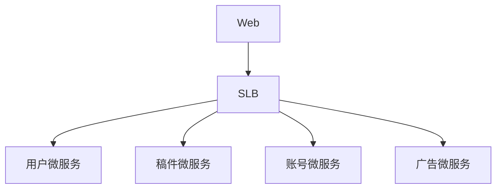
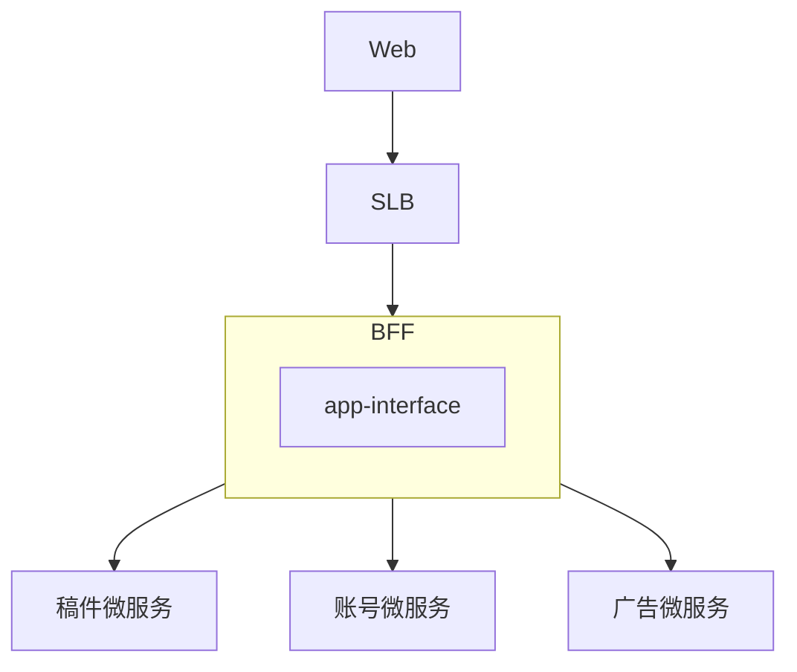
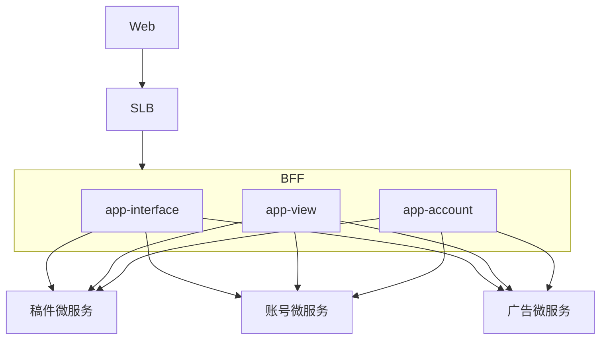
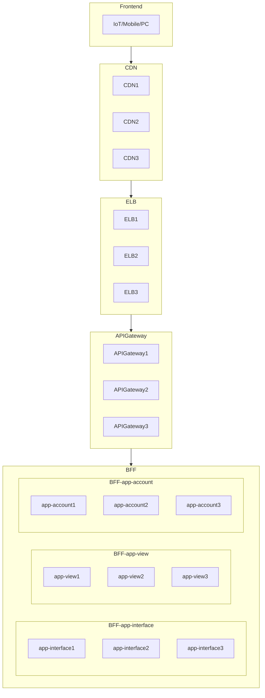

## 说明

实现自动化部署、监控和故障排除，提高系统的可靠性、稳定性和可维护性，为复杂的微服务架构提供了强大的支持
本文的工程化包括:

1. CI/CD：使用GitLab、ArgoCD和Jenkins进行CI/CD，实现自动化的构建、测试和部署流程，减少人工干预，提高部署的一致性和可靠性。
2. 服务治理: 服务注册与发现
3. 可观测性：使用Jaeger进行链路追踪，将链路信息发送到Otel，同时使用ELK进行日志管理，可以帮助您快速定位和解决问题，保障系统的稳定性和性能。
4. 容器编排：使用Kubernetes实现应用的自动横向扩展和缩减，根据负载情况动态调整资源，提高系统的灵活性和资源利用率。
5. 身份验证和流量控制：使用Casdoor和Casbin进行auth，结合Istio作为网关，可以实现对请求的身份验证和授权，同时进行流量控制，保障系统的安全性和稳定性。
6. 存储与消息队列：使用Harbor对应用容器进行push与pull，使用Kafka作为消息队列，可以实现应用的持久化存储和异步通信，提高系统的可靠性和扩展性。
7. 负载均衡：结合Nginx、OpenELB和PureLB，可以实现对请求的负载均衡和流量控制，提高系统的性能和可用性。

## 微服务架构

### BFF

全称: Backend for Frontend, 面向前端的后端服务

#### 为什么需要?

1. 当一个Web服务访问AP时, API会同时请求其它的微服务API, 就需要设计并行编程, 然后进行组装(join), 就需要对这些微服务进行封装,
   找一些好用的BFF库或手写一个BFF层, 还需要处理一个局部微服务失败之后如何处理

#### 作用

组装服务, 是前端与后端团队的中间人, 面向业务的团队, 主要用于适配前端业务, 例如首页,需要访问不同的微服务, 把这些数据进行一个组装,
聚合之类的操作

#### 与面向资源的区别

##### 使用场景

BFF是适合面向外网的业务接口设计.
而与面向资源的设计的HTTP Restful有很大不同, HTTP Restful强调单一性不一样, 更适合内网服务使用

### 非BFF的架构



缺点:

1. 交付速度慢
2. 演进慢, 需要每个服务都需要兼容
3. 客户端到微服务直接通信,强耦合
4. 需要多次请求, 客户端聚合数据, 工作量巨大, 延迟高
5. 协议不利于统一, 各部门有差异, 需要端对端来兼容
6. 统一逻辑无法收敛, 比如安全认证, 限流

### 单点BFF架构



#### 单点BFF缺陷

缺点:

1. 所有流量都经过一个BFF的app-interface层, 只要app-interface层一挂, 全部都挂了
2. 流量高峰也会导致集群宕机
3. 兼容性难, 所有业务都是在一个app-interface层, 与移动端交付更困难

### BFF设计

1. 格式适配(用户在不同网络场景, 2345G/wifi环境下如何加载图片(普清/高清))
2. 兼容, 针对TV/APP/Web/HD进行不同的兼容性设计, 后端微服务不考虑面向终端的兼容设计, 让后端的微服务可以进行快速迭代演进
3. 聚合
4. 裁剪

#### 多点BFF架构

##### 按重要性拆分

例如核心的播放(app-view)拆分一个接口, 一个用户账号拆分一个接口, 杂七杂八的设置都在这个app-interface接口



#### 多点BFF架构缺陷

对跨横切面的逻辑, 例如安全, 限流, 熔断, 统一认证,日志监控等, 都需要推动这些BFF去升级, 有难度

### API Gateway

针对多点BFF架构缺陷, 演进出了API Gateway,把安全, 限流, 熔断, 统一认证这些跨横切面的逻辑都上放到了API Gateway, 由API
Gatewa来实现, 把BFF当成了一个基础设施, 实现关注点, 专门对业务进行兼容, 不对安全, 限流, 熔断, 统一认证这些跨横切面的逻辑这些通用逻辑维护

最终架构图:



在微服务的网关选型上, 可以选择服务网格lstio

## CI

提高交付速度

### 前置

1. 对 React 有基本认知,如`npm run dev`
2. 对 Golang 有基本认知, 会按照教程按安装,启动 Web 项目
3. 对 Docker 有基本认知, 会使用基本命令. 如`run, exec`
4. 对 Nginx 有基本认知, 会按照教程安装, 配置
5. 至少准备 2 台 Unix 服务器(虚拟机也可)

### 准备

#### 本地环境

创建一个 Go Web 项目, 目录结构如下
目录结构:
config: 配置文件目录

```
project
├─ config
└─ main.go
```

#### Web

1. 安装 Node 环境

2. 安装 PNPM 环境

```shell
npm install pnpm
```

3. 在项目根目录的`web`目录使用 Vite 安装一个`React`的`Typescript`模板

```
cd project/web
pnpm create-vite . --template react-ts
```

4. 初始化`git`仓库

```shell
cd project/web
git add .; git commit -m "build: :tada: initial"; git push -u main main --force
```

5. 安装项目依赖

```shell
pnpm i
```

#### Golang

1. 准备 Golang 环境

2. 初始化`git`仓库
   URI: web 项目的 git 的 URI 地址

```shell
cd /project
git init
git submodule add <URI> web
```

3. 编写代码
   main.go

```go
package main

import (
	"github.com/gin-gonic/gin"
	"log"
	"net/http"
)

func main() {
	server := gin.Default()
	server.GET("/", func(c *gin.Context) {
		c.String(http.StatusOK, "Pong")
	})
	if err := server.Run("0.0.0.0:4000"); err != nil {
		log.Fatalln("运行gin服务失败,请检查端口是否被占用", err.Error())
	}
}
```

3. 安装依赖

> 如果该命令失败,则手动创建`go.mod`文件

```shell
go mod tidy
```

### 安装

#### 前置

#### Gitlab

1. 通过`Docker`安装[GitLab](https://juejin.cn/post/7205954522722828344)
2. 测试登录
   浏览器输入服务器 URL,登录服务器, 默认账号为`root`, 密码为`root`
   ![[Pasted image 20230305192600.png]]

> 如果忘记,或者密码错误. 进入 Docker 的 Gitlab 镜像中

输入`sudo docker exec -it gitlab grep 'Password:' /etc/gitlab/initial_root_password` 查看默认密码

3. 在 Gitlab 新建项目 -> 新建空白项目
   ![[Pasted image 20230305193207.png]]
4. 链接到本地仓库
   branch: 你的分支名, 本文为`main`,
   URI: 克隆按钮选择一项, 本文使用 SSH 克隆

```shell
cd project
git remote add <branch> <URI>
```

#### GitLab-Runner

进入 Docker
user: 用户名, 一般为 root
host: 主机 IP, 例如: `192.168.0.152`
port: 端口, 默认为`22`

```bash
ssh <user>@<host> -p <port>
```

1. 通过`Docker`安装[GitLab-Runner](https://juejin.cn/post/7205954522722828344),查阅该文章的三级标题**注册 Gitlab-Runner
   **部分

2. 创建一个名为`runner1`的 Gitlab-Runner

```bash
mkdir -p /data/gitlab-runner/runner1/config //创建一个保存配置文件的目录

docker run \
-d \
--name runner1 \
--restart always \
-v /data/gitlab-runner/runner1/config:/etc/gitlab-runner \
-v /var/run/docker.sock:/var/run/docker.sock \
gitlab/gitlab-runner:latest
```

3. 注册 runner 1. 登录 Gitlab, 默认账号为`root`,密码为`root` 2. 找到你的网站的 URL 与 TOKEN(注册令牌)
   ![[Pasted image 20230305035332.png]]

4. 注册 CI 通道
   [参考](https://docs.gitlab.com/runner/register/index.html#docker)
   `/data/gitlab-runner/confi`替换为你的`gitlab-runner/config`配置文件路径

```bash
docker run \
-it \
-v /data/gitlab-runner/runner1/config:/etc/gitlab-runner \
gitlab/gitlab-runner:latest register
```

### 部署

```mermaid

```

#### 编写自动化脚本

从本地 git push 提交触发 git hook 钩子时, gitlab-runner CI 管道监听触发事件, 然后进行处理, 那么就需要编写 gitlab 的 CI
自动化流程
如何编写自动化流程脚本?

1. 思考以前手动的方式
2. 自动化与手动有什么不同?

最佳实践是在项目根目录创建`.gitlab-ci.yml`,也可以起为别的名称作为 gitlab 的 ci

```ymal
stages:
  - web
  - golang
  - deploy

cache:
  key: edu_system
  paths:
    - ./web/node_modules
    - ./web/client/node_modules
    - ./web/client/dist
    - ./app
    - .cache

job_web:
  stage: web
  image: node:14-alpine
  tags:
    - edu-front-end
  script:
    - npm install pnpm -g
    - cd ./web && pnpm install && cd ./client && pnpm install
    - pnpm eslint:fix && pnpm stylelint:fix && pnpm build
  only:
    - main
  artifacts:
    paths:
      - ./web/client/dist

job_golang:
  stage: golang
  image: golang:alpine # 利用Golang容器进行打包Golang项目
  tags:
    - edu-back-end
  script:
    - mkdir -p .cache
    - export GOPATH="$CI_PROJECT_DIR/.cache"
    - go env -w GOPROXY=https://proxy.golang.com.cn,direct
    - go get
    - go test ./test/
    - go build -o app
    - chmod +x app
  artifacts:
    paths:
      - ./app

job_deploy:
  stage: deploy
  image: rockylinux
  only:
    - main
  tags:
    - edu-front-end
  script:
    - yum makecache # 生成索引缓存索引提供搜索安装速度
    - yum install -y sshpass rsync openssh-clients # 下载`sshpass`,`openssh-clients`用于`SSH`登录服务器
    - tar -czvf ./web/client/distdist.tar.gz --exclude=node_modules ./web/client/* # 进入打包后的`dist`目录,对里面所有文件进行压缩,并排除`node_modules`,压缩后名文件为`dist.tar.gz`
    - export SSHPASS="$PASSWORD" # 设置生产服务器的密码的变量为`SSHPASS`,从gitlab的环境变量获取
    - sshpass -e scp -o stricthostkeychecking=no ./config/dir.sh ./dist.tar.gz root@192.168.0.158:/home/nginx/html/web/ # 发送`dist.tar.gz`文件至生产服务器的`nginx`路径
    - sshpass -e rsync -av -e "ssh -o stricthostkeychecking=no" --exclude="web" --exclude=".git" --exclude=".cache" --exclude=".idea" . root@192.168.0.158:/home/nginx/html/web/temp  # 发送go项目二进制文件与Dockerfile和deploy.sh
    - sshpass -e ssh -o stricthostkeychecking=no root@192.168.0.158 'cd /home/nginx/html/web && bash dir.sh && tar -xzvf ./dist.tar.gz -C /home/nginx/html/web && rm -rf dist.tar.gz' # 进入到生产服务器的`nginx`路径, 对`dist.tar.gz`文件进行解压, 解压完成后删除`dist.tar.gz`文件
    - sshpass -e ssh -o stricthostkeychecking=no root@192.168.0.158 'cd /home/nginx/html/web/temp && bash ./deploy.sh' #部署go项目至Docker镜像

```

#### 编写 Script

判断服务器是否存在上次的临时目录,如果有, 则删除临时目录. 没有则创建该临时目录存放上传的文件(可优化点 1)

```sh
#!/bin/bash

# 需要创建的目录
dir=/home/nginx/html/web/temp
# 列出该目录所有文件
res=$(ls -A $dir)
# 检查该目录是否有文件, 没有则创建
if [ -z "$res" ]; then
  mkdir -p /home/nginx/html/web/temp
else
  mkdir -p /home/nginx/html/web/temp
fi

```

后续的 CI 部署时,判断之前是否存在正在运行的容器, 有则停止运行并删除, 重新生成新容器(可优化点 2)
将 go 二进制文件打包至容器, 对外开放端口与 go server 的端口,运行该容器.

示例:
在项目根目录创建`deploy.sh`文件

```sh
#!/bin/bash

# 检测goimage(.gitlab-ci.yml提供的golang打包后的二进制文件的名称)是否已在运行, 如果已在运行则停止该容器
# docker ps 列出Docker容器列表
# grep goimage 搜索docker ps 列出Docker容器列表有没有goimage这个字串
# awk '{print $12}' 从docker ps 列出Docker容器列表的第12列(容器名)
# docker stop goimage 停止运行goimage容器
if [ $(docker ps | grep goimage | awk '{print $12}') ]; then docker stop goimage; fi

# 如果goimage容器存在 则删除该容器
# docker ps -a 列出全部容器
# docker ps -q 静默模式,只列出容器编号
# docker ps -aq 列出全部容器编号
# --filter name=goimage 过滤出容器名称为goimage的容器
# docker rm -f goimage 删除goimage容器
if [ $(docker ps -aq --filter name=goimage) ]; then
  docker rm -f goimage
fi

# docker images 列出所有镜像
# docker rmi -f 强制删除
# docker rmi -f goimage 强制删除goimage镜像
if [ $(docker images | grep goimage | awk '{print $1}') ]; then docker rmi -f goimage; fi

# 在本目录打包一个镜像名字及标签为goimage的二进制文件可运行的Docker镜像
# docker build --tag 镜像的名字及标签，通常 name:tag 或者 name 格式；可以在一次构建中为一个镜像设置多个标签。
docker build --tag edu_server .

# docker run 运行
# -d 后台运行容器，并返回容器ID
# -p 映射主机与容器的端口
# --name 容器名称
docker run -d -p 4000:4000 --name edu_server edu_server

# 测试服务器是否响应
curl 192.168.0.158:4000/
```

#### 编写 Dockerfile

利用一个小型操作系统来作为支架,使 go 二进制文件运行在该操作系统上
示例:

1. 使用`rockylinux:9.1.20230215-minimal`操作系统(~40Mb)
2. 使用`4000`端口
3. 复制所有项目文件至容器根目录
4. 复制`go`二进制文件至容器根目录下的`app`文件中

```dockerfile
# syntax=docker/dockerfile:1

# 从rockylinux镜像运行
FROM rockylinux:9.1.20230215-minimal

# 映射的端口
EXPOSE 4000

### 从宿主机项目目录下所有的文件复制至容器根目录
COPY . .

# 从宿主机./app复制到容器的目录/app
COPY app ./app

# 启动容器时运行app二进制文件
ENTRYPOINT ["/app"]

```

#### 测试

测试服务器是否响应

```shell
curl 192.168.0.158:4000/
```

http
创建`api.http`

```
# curl 192.168.0.158
GET 192.168.0.158:4000/
```

### Github CI

链接: https://github.com/sunmery/test_github_ci

## CD

示例: https://github.com/sunmery/gitops-argo

## 服务治理

### Consul

#### 服务端搭建

参考[安装与使用Consul](https://juejin.cn/post/7284940213545074749)

#### 客户端使用

示例: https://github.com/Mandala-lab/kubernetes-deploy/tree/main/consul/client

## 可观测性

### 服务端搭建

- Jaeger: 参考[Kubernetes 安装 Jaeger](https://juejin.cn/post/7297152068782702619)

- Prometheus: 参考[kube-prometheus](https://github.com/prometheus-operator/kube-prometheus)

### 客户端使用

https://github.com/sunmery/opentelemetry

## 容器编排

### 服务端搭建

参考[文章](https://juejin.cn/post/7292041370893778983)

### Kubernetes UI

[Kubernetes的可视化资源监控Kuboard](https://juejin.cn/post/7292041370894450727)

## 身份验证和流量控制

[Kratos 身份验证JWT与Casbin鉴权实践](https://juejin.cn/post/7288961029936578560)
[Golang中的鉴权实践](https://juejin.cn/post/7288262451832782903)

### 插件

1. CSI-NFS: https://github.com/Mandala-lab/kubernetes-deploy/tree/main/csi/nfs
2. cert-manager: https://github.com/Mandala-lab/kubernetes-deploy/tree/main/cert-manager
3. metrics-server: https://github.com/Mandala-lab/kubernetes-deploy/tree/main/metrics-server
4. openelb: https://github.com/Mandala-lab/kubernetes-deploy/tree/main/openelb
5. shell-autocompletion: https://github.com/Mandala-lab/kubernetes-deploy/tree/main/shell-autocompletion

## 存储与消息队列

### 搭建

#### Cache

[redis 集群](https://juejin.cn/post/7316788719058305035)

#### RDS

https://juejin.cn/post/7317937213378805796

#### 静态文件存储

https://juejin.cn/post/7314190092129009664

#### 镜像存储

https://juejin.cn/post/7317183162869465124

#### MQ

[Docker 部署 kafka服务端与go客户端的使用](https://juejin.cn/post/7337876697427460107)
[segmentio kafka库的使用](https://github.com/sunmery/segmentio-kafka-go)
[confluent kafka库的使用](https://github.com/sunmery/confluent-kafka-go)

## 负载均衡

### 搭建

#### Nginx

[NGINX二进制编译安装使用QUIC协议](https://juejin.cn/post/7292957290889953291)

#### PureLB

https://juejin.cn/post/7322309671754072098

#### OpenELB

https://juejin.cn/post/7313728275787808808
