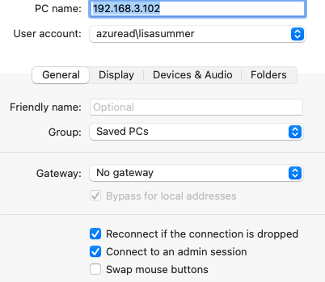

## 先决条件
1. 在目标Windows电脑一定要提前打开“允许远程连接”的设置。**（必须是专业版windows）**  
    “Start”——“设置”——“系统”——“远程桌面”——“启用远程桌面”。并且关闭要求设备使用网络级别身份验证链接；

2. 在Windows终端运行下面命令找到你当前登录的账号, 下面有工作/学校账号类型与普通账号的登录,按照你账号类型进行登录
```shell
whoami
```
## 工作账号登录

在Remote Desktop添加一个在Windows终端输入的`whoami`命令的输出的信息为账号, 然后密码是你账号的密码, 不是你的PIN密码


## 普通账号登录

如果不行, 参考这篇[文章](https://answers.microsoft.com/en-us/windowserver/forum/all/remote-desktop-not-working-with-microsoft-account/71f0c323-688a-4c97-8740-e80eb31ae11d):

AccountType: 可能的值: AzureAD, MicrosoftAccount
```shell
runas /AccountType\username@example.com winver
```

普通账号登录, 一般用户名为:
```
MicrosoftAccount\xxx@@example.com winver
```
